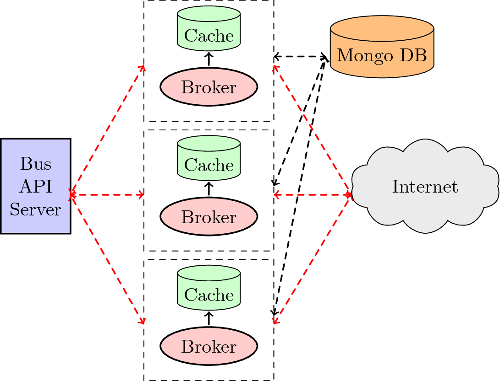

NextBus Reverse Proxy
===

A simple reverse proxy for San Francisco's public transportation powered by NextBus's XML feed.   

## Design Specification

*I've used an epoll based socket server as reverse proxy broker, not twisted/flask framework. For caching purpose, I've used Redis.*
### Configuration
You can configure following parameters in `config.json`
- mongoDb_address  and mongoDb_port 
- redis_adress and redis_port 
- slow_requests_rate 

## API Endpoints
The application address is, by default, `127.0.0.1:8080/`. A brief description of all the end points are given below. `api/v1/stats` endpoint is particular to the state of reverse proxy

|*api/v1/stats*| Exposes Statistics |
|:---:|:---|
|*slow_requests*| Lists the endpoints which had response time higher a certain threshold along with the time taken.|
|*queries*|List all the endpoints queried by the user along with the number of requests for each.|

|End points| Description | 
|:---|:---|
|*api/v1/agencyList*| Lists all agencies.|
|*api/v1/routeList/{agency}*| Lists all the routes for the agency tag supplied.
|*api/v1/routeConfig/{agency}/{route}*| Lists all the stops for the route tag supplied.
|*api/v1/predictByStopId/{agency}/{stopId}*| Lists arrival/departure predictions for a stop.|
|*api/v1/predictByStop/{agency}/{route}/{stop}*| Same as predictByStopId but using the *{stop}* tag instead *{route}* tag is required because *{stop}* tag is associated with a route.  
|*api/v1/predictionsForMultiStops/{agency}/{stops}*| Lists arrival/departure predictions for multi-stops. The format of the *{stops}* tag is *route or stop* . Append more *{/stops}* for more stops.|
|*api/v1/schedule/{agency}/{route}*| Obtain the schedule information for a given *{agency}* and *{route}* tags
|*api/v1/messages/{agency}/{route}*| List the active messages for the selected route. Append *{/route}*for more routes.
|*api/v1/vehicleLocations/{agency}/{route}/{time}*| Lists vehicle locations for the selected *{route}*. *{time}* tag is in msec since the 1970 epoch time. If you specify a time of 0, then data for the last 15 minutes is provided.
  
- Get *{agency}* tags using `agencyList`
-  Get *{route}* tags using `routeList`, 
-  Get*{stop}* and *{stopId}* tags using `routeConfig`.
- A */{route}* tag  can be appended if predictions for only one route are desired.
-  Append `&useShortTitles=true` to have the XML feed return short titles intended for display devices with small screens.

### Examples
   - `api/v1/routeList/sf-muni`
   - `api/v1/routeConfig/sf-muni/E`
   - `api/v1/predictByStopId/sf-muni/15184{/useShortTitles}`
   - `api/v1/predictByStop/sf-muni/E/5184{/useShortTitles}`
   - `api/v1/predictionsForMultiStops/sf-muni/N|6997/N|3909{/useShortTitles}`		
   - `api/v1/schedule/sf-muni/E`
   - `api/v1/vehicleLocations/sf-muni/E/0`
   
## Data Schema
We have used MongoDB for our database, as it is highly available and is a good fit for storing meta data. We write statistics to MongoDB as we want our reverse proxy brokers to have a unified view of data `(slow_request,queries)`

## Caching
To be done by Redis 

## References 
- [Next Bus XML Feed Documentation](http://www.nextbus.com/xmlFeedDocs/NextBusXMLFeed.pdf)
g- [Pro Style Testing](https://msol.io/blog/tech/pro-style-testing/)
