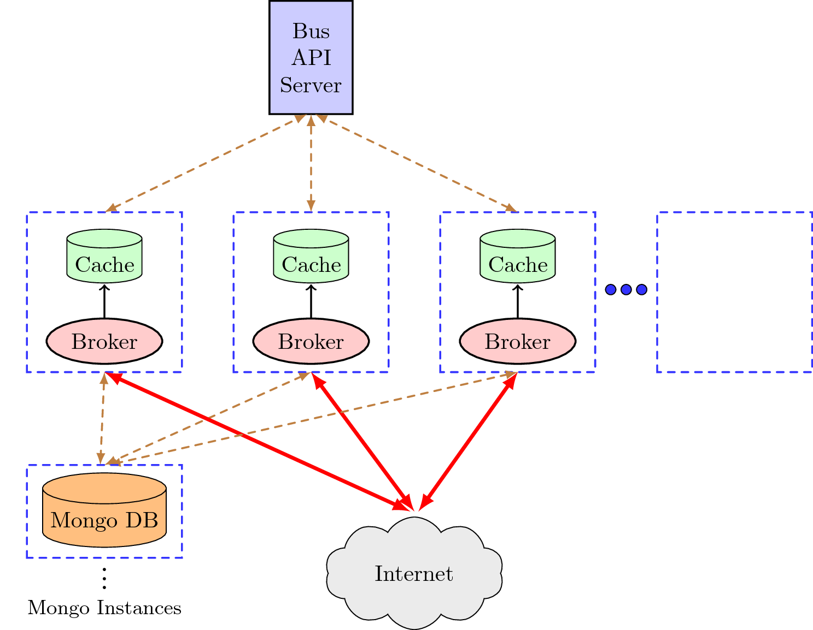

NextBus Reverse Proxy
===

A simple reverse proxy for San Francisco's public transportation powered by NextBus's XML feed.   
## Usage
1. [Install docker-compose](https://docs.docker.com/v1.5/compose/install/) 
2. docker-compose up 
3. [curl localhost:8001/api/v1/agencyList](#examples) 

## Dependencies
- **Custom made epoll socket server as reverse proxy broker.**
	- I've not used twisted/flask framework for routing, as I wanted to try writing a production quality framework/code  
- **Redis for caching the responses of NextBus XML feed** 
- **MongoDB for serving metadata**
- **Python 2.7**
	- pymongo
	- redis
	- xmltodict
	- requests

## Design Specification

**Design Choices**
1. MongoDB is highly available nosql db and is good for storing documents.
	* Can be easily replicated and hence scalable
	* We use docker images here, defined in `docker-compose.yml`
2. Redis was the choice for caching, it supports `key:value` mappings 
	* Currently caching is only done at root level of json/xml document. Further optimization can be done if we parse deeper levels.
	* A timeout for defining freshness of value is defined in `config.json`
3. A single threaded edge triggered epoll framework has been used to handle requests
	* At Application level, only request_handler has to be implemented by user.
	* This server can maintain keep-alive connections or short-lived connections.
	* Threading does not work well with python because of `GIL interpreter lock` 

**Configuration Settings**
You can configure reverseProxy in  `config.json`

- mongodbAddress  and MongodbPort 
- redisAddress and redisPort, redisTimeout 
- slowRequestsRrate
- log file name  

You can configure epollServer in  `epollConfig.json`

- tcp_cork, tcp_nagle optimizations
- listen connections
- log file name

*Logs store state of application and framework, and are located in `logs/`* 

## Reverseproxy API Endpoints 

The application address is, by default, `127.0.0.1:8001/`. A brief description of all the end points are given below. `api/v1/stats` endpoint is particular to the state of reverse proxy

|*api/v1/stats*| Exposes Reverseproxy statistics |
|:---:|:---|
|*slow_requests*| Lists the endpoints which had response time higher a certain threshold along with the time taken.|
|*queries*|List all the endpoints queried by the user along with the number of requests for each.|

|End points| Description | 
|:---|:---|
|*api/v1/agencyList*| Lists all agencies.|
|*api/v1/routeList/{agency}*| Lists all the routes for the agency tag supplied.
|*api/v1/routeConfig/{agency}/{route}*| Lists all the stops for the route tag supplied.
|*api/v1/predictByStopId/{agency}/{stopId}*| Lists arrival/departure predictions for a stop.|
|*api/v1/predictByStop/{agency}/{route}/{stop}*| Same as predictByStopId but using the *{stop}* tag instead *{route}* tag is required because *{stop}* tag is associated with a route.  
|*api/v1/predictionsForMultiStops/{agency}/{stops}*| Lists arrival/departure predictions for multi-stops. The format of the *{stops}* tag is *route or stop* . Append more *{/stops}* for more stops.|
|*api/v1/schedule/{agency}/{route}*| Obtain the schedule information for a given *{agency}* and *{route}* tags
|*api/v1/messages/{agency}/{route}*| List the active messages for the selected route. Append *{/route}*for more routes.
|*api/v1/vehicleLocations/{agency}/{route}/{time}*| Lists vehicle locations for the selected *{route}*. *{time}* tag is in msec since the 1970 epoch time. If you specify a time of 0, then data for the last 15 minutes is provided.

	Get {agency} tags using `agencyList`
	Get {route} tags using `routeList`, 
    Get {stop} and {stopId} tags using `routeConfig`.
    A /{route} tag  can be appended if predictions for only one route 
    are desired.
    Append `&useShortTitles=true` to return short titles intended for display
    devices with small screens.

### Examples
   
1. `api/v1/agencyList`
2. `api/v1/routeList/sf-muni`
2. `api/v1/routeConfig/sf-muni/E`
3. `api/v1/predictByStopId/sf-muni/15184{/useShortTitles}`
4. `api/v1/predictByStop/sf-muni/E/5184{/useShortTitles}`
5. `api/v1/predictionsForMultiStops/sf-muni/N|6997/N|3909{/useShortTitles}`		
6. `api/v1/schedule/sf-muni/E`
7. `api/v1/vehicleLocations/sf-muni/E/0`
   

## References 
- [Next Bus XML Feed Documentation](http://www.nextbus.com/xmlFeedDocs/NextBusXMLFeed.pdf)
